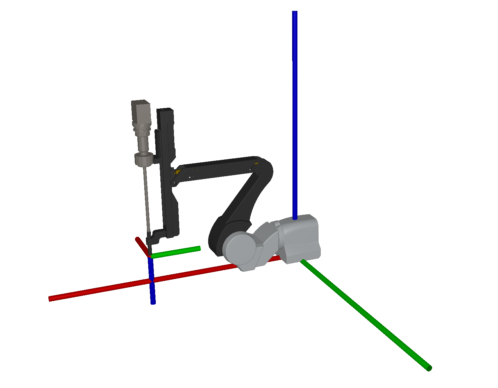

# dVRK Description


This repository contains **unofficial** URDF description files and meshes for the [da Vinci Research Kit (dVRK)](https://github.com/jhu-dvrk) surgical robots. 

**Gallery**
| | Endoscopic Camera Manipulator (ECM) | Patient Side Manipulator (PSM) | Setup Joints (SUJ) | Master Tele Manipulator (MTM) |
|-|-|-|-|-|
| Classic | | | | |
| Si |  |  |  |  |

| 8mm Small Clip Applier - Classic | 8mm Cadiere Forceps - Classic | 5mm Round Tip Scissors - Classic | 8mm Large Needle Driver - Si |
|------------------------|---------------------|------------------------|------------------------|
|||||




## Getting Started

1. Compose your dVRK robot description [xacro](https://wiki.ros.org/xacro) file using the provided macros defined in the `urdf/include` directory. Examples can be found in the `urdf/examples` directory.
2. Compile your xacro file to plain URDF using the `xacro` command-line tool (if using ROS) or any other xacro processor, such as [xacrodoc](https://github.com/adamheins/xacrodoc):
   ```bash
   xacrodoc your_robot_description.xacro -o your_robot_description.urdf
   ```
3. Use the generated URDF file for your applications.